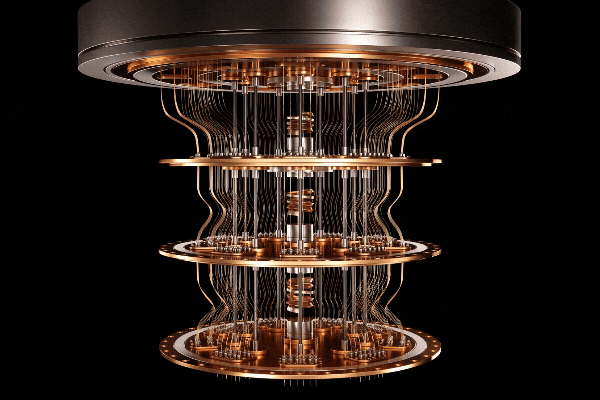

<table>
  <tr>
    <td valign="top">
      <h2>Research Areas</h2>
      <ul>
        <li>Hardware security</li>
        <li>Post-quantum cryptography</li>
        <li>Side-channel attacks</li>
        <li>Signal processing</li>
        <li>RTL design for crypto accelerators</li>
      </ul>
      
       
      
    </td>
    <td valign="middle" align="center">
      
    </td>
  </tr>
</table>

<!-- Source: https://nationalcioreview.com/wp-content/uploads/2025/01/TNCR-Staff-2.gif -->
